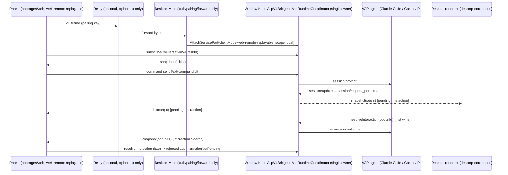

# Phone <-> desktop session sync: research and recommendation

Status: research only. No code in this change. Data checked on 2026-09-24.

Goal: Lody-style two-way sync for coding-agent sessions. A conversation started on the phone
shows up live on the desktop, and the other way round. Both ends can send prompts and answer
permission prompts. CodeZ runs Claude Code, Codex and Pi over ACP and turns ACP
`session/update` into its own V4 conversation snapshot ("V4 rows"):
`packages/services/src/agent-runtime/acpV4Bridge.ts` and `acpConversationProjection.ts`.

## TL;DR

Recommendation **(b)**: no external project is mature, license-compatible, self-hostable
**and** usable as a library or protocol without adding a second copy of the conversation
state. Extend CodeZ's own `web-remote-replayable` path instead. Most of the multi-client
semantics already exist in the window Host. The missing pieces are the phone transport,
pairing and auth, bandwidth-friendly ACP frames, and tests. For access outside the LAN,
reuse **Paseo's Apache-2.0 E2E relay channel** (`@getpaseo/relay`, and optionally the
Apache-2.0 `getpaseo/paseo-relay` server) as a transport only. Do not adopt Paseo's
protocol.

## 1. CodeZ's existing remote path: what works for ACP and what is missing

### 1.1 What already works (from reading the code, not from running it)

The multi-client parts sit in the window Host and already cover ACP sessions:

| Concern                                                 | Evidence                                                                                                                                                                                                                 | Behaviour for ACP                                                                                                                                                                                                                                                                                                     |
| ------------------------------------------------------- | ------------------------------------------------------------------------------------------------------------------------------------------------------------------------------------------------------------------------ | --------------------------------------------------------------------------------------------------------------------------------------------------------------------------------------------------------------------------------------------------------------------------------------------------------------------- |
| One Host per window, shared by renderer and phone       | `packages/desktop/src/host/index.ts:4-14` (header: "Renderer / Mobile ←MessagePort→ Window Host"); `AttachServicePort` handler at `index.ts:2734-2771`                                                                   | A phone attachment reaches the **same** `AcpV4Bridge` / `AcpRuntimeCoordinator`, so no second ACP process is started.                                                                                                                                                                                                 |
| Connection mode is set by the Host and cannot be forged | `packages/services/src/zcode-agent/zcodeAgentConnectionScope.ts:26-110` (`withTrustedConnection` strips caller `clientMode`)                                                                                             | Same for ACP.                                                                                                                                                                                                                                                                                                         |
| ACP subscribe goes through the same conversation topic  | `zcodeAgentService.ts:5055-5064`: `subscribeConversationV4` → `acpV4Bridge.subscribe` → `conversationTopic(taskId)`; frames go out on the shared `conversationFrameEmitters` (`zcodeAgentService.ts:1146-1152`)          | Every subscriber gets its own `subscriptionId`. `AcpV4Bridge.publish` sends to **all** subscriptions for `workspaceKey + taskId` (`acpV4Bridge.ts:316-325`), and the connection scope filters frames by `subscriptionId` (`zcodeAgentConnectionScope.ts:392-400`). Desktop and phone therefore both see live updates. |
| Commands from any client                                | `zcodeAgentService.ts:5180-5192` routes `createSession` with `runtimeId`, plus any command on an ACP task, to `acpV4Bridge.command`                                                                                      | `createSession`, `sendText`, `stop`, `resolveInteraction`, `switchModelConfig` and `createSelectionSideSession` work from any attachment. `commandId` makes them idempotent (`queryCommand`, `acpV4Bridge.ts:271-309`).                                                                                               |
| Answering permissions from either end                   | `acpRuntimeCoordinator.ts:457-477` `respondPermission`; the pending interaction is projected into V4 (`acpConversationProjection.ts:320-355`)                                                                            | The first answer wins. A second client gets `rejected / acpInteractionNotPending` (`acpV4Bridge.ts:227-247`), and the snapshot republish clears the prompt on the other end.                                                                                                                                          |
| Task list                                               | `node.ts:2286-2289` `announceAcpTaskChanged` → `workspace_task_list_changed`; merged in `packages/ui/src/hooks/useWorkspaceTaskLists.ts:400-409`                                                                         | ACP tasks appear on any client that subscribes to workspace events.                                                                                                                                                                                                                                                   |
| Recovery                                                | `resyncConversationV4` → `acpV4Bridge.resync` (`zcodeAgentService.ts:5171-5178`); the design says phones recover through the same projection (`openspec/changes/archive/2026-09-23-add-acp-agent-runtimes/design.md:45`) | Every frame is a full, self-contained snapshot, so a replayable client recovers after any gap.                                                                                                                                                                                                                        |

Conclusion: **once a phone is attached to the desktop's window Host as `web-remote-replayable`,
ACP sessions should already sync both ways, including permission answers.** Nothing in
the ACP bridge is desktop-only. This conclusion comes from code reading. No test covers two
concurrent ACP subscribers (the only `web-remote-replayable` tests are
`packages/services/test/nonCliAcpRetirement.test.ts` and `importedClaudeRecovery.test.ts`,
and both test the legacy snapshot path).

### 1.2 Gap list

| #   | Gap                                                                                                                                                                                                                                                                                                                                                                                                                                                                                                                                                                                 | Evidence    |
| --- | ----------------------------------------------------------------------------------------------------------------------------------------------------------------------------------------------------------------------------------------------------------------------------------------------------------------------------------------------------------------------------------------------------------------------------------------------------------------------------------------------------------------------------------------------------------------------------------- | ----------- |
| G1  | **No phone transport into the desktop Host in this repo.** The Host accepts `AttachServicePort{clientMode:"web-remote-replayable"}`, but Main only issues it for renderer reload (`desktop-continuous`, `packages/desktop/src/main/desktopWindowLifecycle.ts:139-160`) and for Bot remote-workspace ports (`desktopRemoteSessions.ts:881-996`). The upstream phone relay and pairing client is not part of the open-source tree. The "Mobile remote control" UI only configures chat bots (`packages/ui/src/WebRemoteControlDialog.tsx`, `i18n/locales/en-US.ts:1744-1747`).        | code        |
| G2  | **The standalone servers are separate Hosts.** `packages/server/src/http.ts:325-346` (token auth, serves `packages/web`, `/ws` = `web-remote-replayable`) and `packages/zcode-server-cli/src/server-core/http.ts:126-170` (loopback only; "Core 尚未接入 token middleware") each build their own `createLocalServices`, so their own `AcpV4Bridge`. A phone on such a server does **not** see ACP sessions owned by the desktop's local Host. The only shared-Host arrangement possible today is the desktop opening the workspace as a `server` remote target of that same server. | code        |
| G3  | **ACP frames are full snapshots on every update.** Each ACP `session/update` calls `advance()` and `publish` (`acpManagedSession.ts:118`, `acpRuntimeCoordinator.ts:572-577`). `AcpV4Bridge.publishTo` always sends `payload.kind:"snapshot"` with `fromSeq:0` (`acpV4Bridge.ts:327-350`), so the cost per token chunk grows with the transcript size, times every subscriber. This is fine over a MessagePort but not over mobile data or a relay. It needs coalescing (for example about 100 ms per session) and ideally row-level deltas like the CLI's replayable frames.       | code        |
| G4  | Bots (WeChat, Feishu, Lark, Telegram) do not support ACP. `botsService.ts:4752-4990` uses the legacy `zcodeTaskService.createTask`/`sendPrompt` with no `runtimeId`. This does not matter if the phone uses the V4 web UI.                                                                                                                                                                                                                                                                                                                                                          | code        |
| G5  | No pairing, device identity, revocation or E2E encryption for a phone reaching the desktop from outside the LAN. `packages/server` uses a single static token set as a cookie (`http.ts:227-237`).                                                                                                                                                                                                                                                                                                                                                                                  | code        |
| G6  | No push notifications for pending permissions or finished turns.                                                                                                                                                                                                                                                                                                                                                                                                                                                                                                                    | code search |
| G7  | No automated test for: desktop and phone subscribed to one ACP task, a prompt from either end, a permission answered by one end and cleared on the other, and a replayable reconnect in the middle of a turn. AGENTS.md requires both delivery semantics to be verified.                                                                                                                                                                                                                                                                                                            | tests       |
| G8  | The phone client is the responsive web build (`packages/web`), not a native app. Whether the web build exposes the ACP runtime picker (`packages/ui/src/settings/model-provider-section/AcpProviderDetail.tsx`, `v4/SessionPane.tsx`) was **not verified**.                                                                                                                                                                                                                                                                                                                         | unverified  |

## 2. External options

"Reusable" means that CodeZ could keep its ACP runtime and projection as the single owner and
plug into the option's sync layer, while reusing that project's mobile client.

| Project                                                                                          | License (Apache-2.0 compatible?)                                  | Stars / activity (2026-09-24)                                                                     | Agents                                                                                                                                | Sync architecture                                                                                                                                                                                                                                                                                                                    | Self-host                                                                                                                                                                    | Mobile client                                             | Reusability for CodeZ                                                                                                                                                                                                                                                                                                                                                                                                                                                             |
| ------------------------------------------------------------------------------------------------ | ----------------------------------------------------------------- | ------------------------------------------------------------------------------------------------- | ------------------------------------------------------------------------------------------------------------------------------------- | ------------------------------------------------------------------------------------------------------------------------------------------------------------------------------------------------------------------------------------------------------------------------------------------------------------------------------------ | ---------------------------------------------------------------------------------------------------------------------------------------------------------------------------- | --------------------------------------------------------- | --------------------------------------------------------------------------------------------------------------------------------------------------------------------------------------------------------------------------------------------------------------------------------------------------------------------------------------------------------------------------------------------------------------------------------------------------------------------------------- |
| **slopus/happy** (monorepo, now includes happy-server)                                           | MIT (root and `packages/happy-app/LICENSE`): **yes**              | ~23.9k stars; `happy` CLI 1.2.5 on npm 2026-09-22; last commit 2026-09-22                         | Claude Code, Codex, Gemini, OpenClaw, Antigravity, plus a generic ACP backend (`happy-cli/src/agent/acp`, `@agentclientprotocol/sdk`) | Central server (Fastify, Postgres or PGlite, Socket.IO `/v1/updates`) that **stores** E2E-encrypted messages, session metadata and `agentState`. Per-user monotonic `seq`. Point-to-point RPC through the server (`permission`, `spawn-happy-session`). Clients encrypt with AES-GCM or NaCl.                                        | Yes (`happy server`, `happy-server-self-host` 1.1.11, 2026-06-10)                                                                                                            | iOS, Android, web (published); desktop macOS app          | **Medium.** `@slopus/happy-wire` 0.1.0 (MIT, 2026-02-13) publishes the schemas. CodeZ would have to act as a Happy session and machine client: port the crypto, map V4 rows to Happy session-protocol events (`text`, `tool-call-start/end`, `turn-start/end`), map ACP permissions to `agentState.requests` plus a `permission` RPC, and implement `spawn-happy-session` so phone-created sessions reach CodeZ. The server keeps a **second persistent copy** of the transcript. |
| slopus/happy-server (old separate repo)                                                          | MIT                                                               | Last commit 2026-02-13; folded into the monorepo above                                            | n/a                                                                                                                                   | as above                                                                                                                                                                                                                                                                                                                             | as above                                                                                                                                                                     | n/a                                                       | Superseded.                                                                                                                                                                                                                                                                                                                                                                                                                                                                       |
| **getpaseo/paseo**                                                                               | Apache-2.0 (root `LICENSE`; `package.json` fields empty): **yes** | ~18.4k stars; v0.9.2 on 2026-09-24; ~5.5k commits                                                 | Claude (Agent SDK), Codex (app-server), Copilot / Cursor / Kimi / Trae / generic ACP, OpenCode, Pi                                    | Local **daemon** owns agents and timelines. Clients connect over WebSocket, directly or through an optional **zero-knowledge relay** (Curve25519 plus NaCl box, QR pairing that transfers the daemon public key). The daemon stores data in files; the relay stores nothing.                                                         | Yes (daemon is local; relay is self-hostable: `getpaseo/paseo-relay`, Elixir, Apache-2.0, ~87 stars, or the legacy Cloudflare adapter in the repo)                           | iOS, Android, web (Expo), Electron desktop, CLI           | **Relay layer: high.** `@getpaseo/relay` (npm 0.9.2) exports `createDaemonChannel`, `createClientChannel`, `EncryptedChannel` and key helpers, and it does not depend on Paseo's app protocol. **Sync protocol and mobile app: low.** The app speaks Paseo's large daemon protocol (agents, timeline, workspaces, terminals). Reusing it means either implementing that protocol in CodeZ or running Paseo's daemon as a second agent owner.                                      |
| tiann/hapi                                                                                       | **AGPL-3.0: not compatible**                                      | ~5.1k stars; last commit 2026-09-24                                                               | Many (Claude, Codex, Cursor, Grok, OpenCode, Kimi, Copilot, Pi, ...)                                                                  | Self-hosted hub (SQLite, Socket.IO to CLI, REST+SSE to clients), optional WireGuard+TLS relay, push relay                                                                                                                                                                                                                            | Yes                                                                                                                                                                          | Native iOS, Android, PWA, Telegram mini-app               | Excluded (license). Architecture reference only.                                                                                                                                                                                                                                                                                                                                                                                                                                  |
| siteboon/claudecodeui (CloudCLI)                                                                 | **AGPL-3.0-or-later: not compatible**                             | ~13.8k stars; last commit 2026-09-24                                                              | Claude Code, Cursor CLI, Codex, Gemini                                                                                                | Web server on the dev machine with a responsive web UI; hosted "CloudCLI Cloud"                                                                                                                                                                                                                                                      | Yes                                                                                                                                                                          | Responsive web                                            | Excluded (license).                                                                                                                                                                                                                                                                                                                                                                                                                                                               |
| omnara-ai/omnara                                                                                 | Apache-2.0                                                        | ~2.9k stars; last commit 2026-09-24; `omnara` npm 1.0.16 (2026-09-23)                             | Now a managed-agent API platform (Go, Postgres); no longer a "Claude Code on your phone" wrapper                                      | Cloud or self-hosted agent platform                                                                                                                                                                                                                                                                                                  | Yes                                                                                                                                                                          | Dashboard and Slack; no longer targets local CLI agents   | **Not applicable** after the pivot. It runs its own agents instead of syncing local ACP sessions.                                                                                                                                                                                                                                                                                                                                                                                 |
| iOfficeAI/AionUi                                                                                 | Apache-2.0: **yes**                                               | ~33.1k stars; v2.2.2 (commit 2026-09-09)                                                          | ACP agents (Claude Code, Codex, Gemini, Qwen, ...)                                                                                    | "WebUI mode": the Electron app starts an embedded HTTP/WS server (default port 25808, password or QR login, LAN or `allowRemote`). The same backend serves desktop and browser, so state is shared by construction. Chat-bot channels (Telegram, Lark, DingTalk, WeChat). No relay or E2E.                                           | Yes (it is the desktop app)                                                                                                                                                  | Browser; `mobile/` Expo app in the repo (private package) | **Pattern, not a library.** It is the same shape as recommendation (b): the desktop backend exposes a second transport, and phone clients attach to the same state owner.                                                                                                                                                                                                                                                                                                         |
| LodyAI/Lody (open parts, `/tmp/ref/Lody`)                                                        | Apache-2.0                                                        | ~1.1k stars; last commit 2026-09-24                                                               | ACP agents (Claude, Codex, Kimi, Pi, Devin, Grok, ...)                                                                                | Loro CRDT documents (loro-repo, Flock) plus **Loro Streams** for content and machine RPC, plus **Convex** for org and permissions (`specs/communication-architecture.zh.md`). The OSS build is **local-only by construction** (`DEV.md`: "The OSS desktop composition is local by construction"; `@lody/cloud-api` holds DTOs only). | **No**: the cloud (Convex backend and Loro Streams service) is not in the repo, and Loro Streams is a hosted service (`streams.loro.dev`); no self-hostable server was found | iOS and Android apps are proprietary store apps           | **Low.** The open parts are the CRDT client libraries (`loro-crdt` MIT, `@loro-dev/streams-client` MIT) and `packages/loro-streams-rpc`. Adopting them means rebuilding CodeZ's conversation state as CRDT documents: a new state owner, against the CommandInbox and owner/lease rules. Its permission UX spec (`specs/permission-requests.md`) is worth copying.                                                                                                                |
| ACP-native remote: ACP "Streamable HTTP & WebSocket transport" RFD                               | Apache-2.0 (spec and SDKs)                                        | RFD **Active** (Transports WG, July 2026); reference implementation in Goose; SDK support landing | Any ACP agent                                                                                                                         | Remote **client ↔ agent** JSON-RPC. The spec says sessions belong to one connection, there is no multi-client attach, and "in-flight messages are not replayed" (resumability deferred to v2).                                                                                                                                       | n/a                                                                                                                                                                          | n/a                                                       | **Wrong layer.** CodeZ is the single ACP client. Letting the phone speak ACP to the agent would bypass CodeZ's projection, CommandInbox and permission owner, and ACP has no fan-out or replay.                                                                                                                                                                                                                                                                                   |
| ACP-native remote: `formulahendry/acp-ui` + `@rebornix/stdio-to-ws`; `vcoderun/acpkit` acpremote | MIT                                                               | acp-ui ~480 stars                                                                                 | Any ACP agent                                                                                                                         | stdio agent wrapped as an ACP-over-WebSocket endpoint; one client per agent connection                                                                                                                                                                                                                                               | Yes                                                                                                                                                                          | acp-ui has desktop, web and mobile builds                 | Same problem as above: single client, no shared session or replay.                                                                                                                                                                                                                                                                                                                                                                                                                |

## 3. Why not adopt Happy (the strongest outside candidate)

Happy is the only option that is license-compatible, self-hostable, **and** ships a
published phone app with an ACP-capable CLI. It still fails the "reusable without
duplicating state" test:

1. **Second source of truth.** Happy's server stores the encrypted transcript and
   `agentState`. CodeZ already owns the transcript (`acpTranscriptStore.ts`) and the
   projection. AGENTS.md says the external relay "只做鉴权、配对、心跳、转发… 不保存任务队列、快照等业务状态"
   (it only handles auth, pairing, heartbeat and forwarding, and does not store task queues,
   snapshots or other business state). Happy's server does store it. Two writers (the phone
   through the Happy server, the desktop through V4) would need reconciliation, with
   echo-loop and ordering problems.
2. **Lossy mapping.** V4 rows (reasoning, plan, tool input and output streaming,
   `turnHeader`, config and mode, side sessions) do not map 1:1 onto Happy's nine session
   events. ACP permission options (`optionId` list, allow or reject, once or always) are
   squeezed into Happy's `approved | approved_for_session | denied | abort`.
3. **Phone-originated sessions** need CodeZ to register as a Happy machine daemon and handle
   `spawn-happy-session`, and to carry model and runtime selection in Happy's metadata. That
   is a large surface for a protocol that is still changing (`docs/session-protocol.md`
   "replaces the existing mix of output, codex, and custom acp formats";
   `@slopus/happy-wire` has only one 0.1.0 release).
4. **Account model.** The phone must pair to a Happy account secret. That identity is
   separate from CodeZ workspace identity and `remoteSessionId`, so
   `workspaceIdentity?.trim() || workspacePath` isolation would have to be re-implemented on
   top of it.

A Happy bridge could be built as a best-effort mirror ("view and answer in the Happy app"),
but it would not make both ends first-class. It fails the requirement.

## 4. Recommendation

**(b) Extend CodeZ's own remote path. For off-LAN access, reuse Paseo's Apache-2.0 E2E relay
channel as a transport only.**

Reasons: the hard parts of two-way sync (one owner, fan-out to N subscribers, idempotent
commands, first-wins permission answers, replayable recovery) are already in the window
Host and already cover ACP (section 1.1). What is missing is transport, pairing and
efficiency (section 1.2). No external protocol can supply those without a second
state owner.

### Owners and event order

### Integration plan (backend and sync only)

1. **Tests first (G7).** In `packages/services/test/`, add a two-subscriber
   `AcpV4Bridge`/`zcodeAgentService` test using the existing ACP replay fixtures: a
   continuous and a replayable connection scope on one task, a prompt from each, a
   permission answered by one and rejected for the other, resync after a dropped
   subscription, and an ACP `createSession` from the replayable client.
2. **Frame efficiency (G3).** In `AcpV4Bridge`, coalesce publishes per
   `workspaceKey + taskId` (always flush on phase change and on permission request or
   settle). Then add row-level deltas using the existing V4 conversation delta payloads,
   with snapshot fallback on `resync`. This keeps the projection as the only owner and
   changes nothing on the desktop side.
3. **Phone attachment into the desktop Host (G1).** Add a Main-side "phone gateway". It
   accepts a WebSocket (LAN listener or relay channel), authenticates the paired device, and
   issues `AttachServicePort{clientMode:"web-remote-replayable", scope:{kind:"local"}}` to the
   window Host, the same message the renderer-reload path uses. Wrap the socket like
   `packages/server/src/http.ts:44-125` (`SocketProtocol` → `ChannelServer`, with a
   connection scope and provisioning blocked for non-trusted clients). Main forwards only.
   Serve the `packages/web` build from the same listener. Remote workspaces carry
   `remoteSessionId` through the existing `attachRemoteWorkspaceSessionHost`.
4. **Pairing and auth (G5).** QR code containing {listener or relay URL, desktop public key,
   one-time pairing secret}. Per-device keys stored by Main. Revocation in Settings (reuse
   the existing "Mobile remote control" dialog entry). On the LAN, TLS or a Tailscale
   address. Outside the LAN, use `@getpaseo/relay` `createDaemonChannel` /
   `createClientChannel` (Curve25519 + NaCl box) with a self-hosted `paseo-relay`
   (Apache-2.0) or a small Node relay using the same channel. The relay sees only ciphertext
   and stores nothing, which satisfies AGENTS.md. Keep the NOTICE and attribution for any
   copied Paseo code.
5. **Notifications (G6, optional).** Send a push when an ACP permission becomes pending. The
   payload is encrypted and carries only `{taskId, interactionId}`; the phone fetches details
   over the channel.
6. **Out of scope or later.** Bot channels for ACP (G4), a native app (G8: verify first that
   the web build's model picker lists ACP runtimes).

Interim option to validate the semantics before building G1: run `packages/server`
(`entry-http`, with a token) on the dev machine. Open the workspace in the desktop app as a
`server` remote target, and open the web UI from the phone against the same server. Both
are then clients of one Host and one `AcpV4Bridge`. This has not been tried; it needs the
agent binaries and logins on that machine.

## Sources

- Happy: https://github.com/slopus/happy (README, `docs/protocol.md`, `docs/encryption.md`,
  `docs/session-protocol.md`, `docs/realtime-sync-and-rpc.md`,
  `packages/happy-server-self-host/README.md`, `packages/happy-cli/src/api/types.ts`);
  https://github.com/slopus/happy-server ; npm `happy`, `@slopus/happy-wire`,
  `happy-server-self-host`.
- Paseo: https://github.com/getpaseo/paseo (`LICENSE`, `docs/architecture.md`,
  `packages/relay/src/index.ts`, `CHANGELOG.md`); https://github.com/getpaseo/paseo-relay ;
  npm `@getpaseo/relay`.
- HAPI: https://github.com/tiann/hapi (`LICENSE`, `docs/guide/how-it-works.md`,
  `relay/README.md`).
- CloudCLI / claudecodeui: https://github.com/siteboon/claudecodeui (`LICENSE`, `NOTICE`).
- Omnara: https://github.com/omnara-ai/omnara (README).
- AionUi: https://github.com/iOfficeAI/AionUi (`LICENSE`,
  `docs/prds/remote/webui/webui.md`, `mobile/`).
- Lody: https://github.com/LodyAI/Lody (local clone: `README.md`, `DEV.md`,
  `specs/communication-architecture.zh.md`, `specs/permission-requests.md`,
  `packages/loro-streams-rpc`); https://streams.loro.dev/ ; https://github.com/loro-dev/loro
- ACP transport RFD: https://agentclientprotocol.com/rfds/streamable-http-websocket-transport ;
  https://github.com/agentclientprotocol/agent-client-protocol/pull/721
- ACP-over-WebSocket bridges: https://github.com/formulahendry/acp-ui ;
  https://github.com/vcoderun/acpkit/tree/main/packages/transports/acpremote ;
  https://github.com/anomalyco/opencode/issues/13388
- Star counts come from the GitHub web pages on 2026-09-24 (the GitHub API was not reachable
  from this environment) and are approximate. Licenses and latest commits were checked in
  shallow clones.
