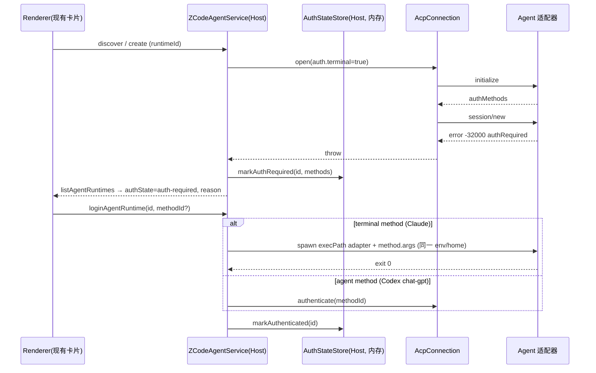

## Context

`2026-09-23-add-acp-agent-runtimes` 建立了 ACP 执行链路：Host 按 `runtimeId` 解析 `AcpRuntimeSpec`，
`AcpConnection` 以 argv 启动 Agent，`AcpRuntimeCoordinator` 拥有会话执行，task index 持久化
`runtimeId/nativeSessionId/agentServerFingerprint`。本变更在同一链路上增加内置 Runtime，不新增执行所有者。

## Goals / Non-Goals

- Goals：三个内置 Runtime 可直接选择；BYOK 与订阅两种认证；原生 home 隔离；可复现安装；离线回放与在线实测。
- Non-Goals：新增前端 UI（沿用供应商卡片的 `installed/reason/models` 与模型选择器）；Windows 上的 Pi
  （acp-extension-pi 在 Windows 需要 CI 预编译的 Job 原生模块，源码安装拿不到，明确报告不支持）。

## Decisions

### D1 Runtime 与配置

- `BuiltinRuntimeDefinition`（代码常量）：`claude-code | codex | pi`，固定版本、npm 依赖与 lockfile、
  适配器入口、原生二进制定位、支持的认证模式。
- `AgentConfig`（用户数据，`<数据根>/v2/agent-configs.json`，0600）：`{id, name, runtime, auth, env,
secretEnv[], defaultModel?, preset?}`。`id` 即 `AgentRuntimeId`，与 `agent-servers.json` 共享命名空间并互斥。
  三个默认配置 `claude-code`、`codex`、`pi` 无需落盘即存在，可被同 id 覆盖。
- 秘密值：`ICredentialService` 键 `acp-agent-config/<id>/<ENV>`（已有加密存储）。配置文件、fingerprint、日志、
  诊断与状态均不含秘密。
- `AcpRuntimeSpec.distribution = "builtin"`，`fingerprint = sha256(runtime, id, nativeHome)`：只标识原生会话存储。
  改 base URL / 模型不使旧会话失效；换 home（例如 byok ↔ cli-login）则旧会话按既有规则拒绝继续。

### D2 启动解析

`resolveLaunch(spec)` 返回 `{executable, args, env?}`。内置 Runtime：

1. `ensureBuiltinRuntimeInstalled(runtime)`：`<数据根>/acp-runtimes/<runtime>/<version>/`，存在
   `.codez-complete` 即复用；否则在同级临时目录 `npm ci --ignore-scripts`（lockfile 随源码），Pi 另从
   `LodyAI/acp-extension-pi@<commit>` `git fetch` 源码并用锁定的 `typescript` 编译，最后 rename 发布。
   进程内 promise 去重 + 目录文件锁防多进程重复安装。npm/git 均按 argv 调用。
2. `buildBuiltinLaunchEnv()`（纯函数）：宿主 env 白名单 → 剥离冲突变量 → 注入配置 env/秘密 →
   私有 home → `NO_PROXY` 追加 `127.0.0.1,localhost,::1`；Electron 下加 `ELECTRON_RUN_AS_NODE=1`。
3. `executable = process.execPath`，`args = [adapterEntry, ...runtimeArgs]`。

| Runtime     | 私有 home                                          | BYOK 注入                                                                                                                                                           | 订阅剥离                                                                                          |
| ----------- | -------------------------------------------------- | ------------------------------------------------------------------------------------------------------------------------------------------------------------------- | ------------------------------------------------------------------------------------------------- |
| claude-code | `CLAUDE_CONFIG_DIR=<数据根>/acp-homes/<id>/claude` | `ANTHROPIC_BASE_URL`、`ANTHROPIC_AUTH_TOKEN`、`ANTHROPIC_API_KEY=""`、`ANTHROPIC_DEFAULT_{OPUS,SONNET,HAIKU}_MODEL`、`ANTHROPIC_SMALL_FAST_MODEL`、`API_TIMEOUT_MS` | 宿主与配置里所有 `ANTHROPIC_*`、`CLAUDE_CODE_USE_*`、`AWS_BEARER_TOKEN_BEDROCK`、`OPENAI_API_KEY` |
| codex       | `CODEX_HOME=<...>/codex`                           | `CODEX_CONFIG={model_provider, model, model_providers.
{base_url, env_key, wire_api}}`、`MODEL_PROVIDER`、`CODEZ_CODEX_PROVIDER_KEY`                              | `OPENAI_*`、`CODEX_API_KEY`、`AZURE_OPENAI_*`、`CODEX_CONFIG`                                     |
| pi          | `PI_CODING_AGENT_DIR=<...>/pi`                     | `--provider 
 --model <m>`、provider env（如 `OPENROUTER_API_KEY`）                                                                                               | 不支持订阅                                                                                        |

`cli-login` 模式显式指向用户全局 home（仅用户选择时），仍剥离 BYOK 变量。

### D3 启动闸门

`AcpStartupGate(2)` 包住 `spawn → initialize → session/new|load`（含配置发现）。Codex app-server 在同一
`CODEX_HOME` 并发初始化会竞争 home 目录；闸门保证最多两个同时握手，prompt 阶段不受限。

### D4 认证

- 所有者：`AuthStateStore` 是认证状态唯一所有者（Host 内存，不落盘；凭据由 CLI 自己的存储持有）。
  状态：`unknown → auth-required → authenticating → authenticated`，`logout` 回到 `auth-required`。
- 触发：`session/new|load|prompt` 返回 -32000 → `auth-required`；turn 以 “Sign-in required” 错误结束。
  不重试、不切换 Runtime、不改用 BYOK。
- 方法选择：订阅配置优先 `claude-ai-login`（Claude）、`chat-gpt`（Codex）；`deviceAuth` 选项走
  `codex login --device-auth`（直接调用受管原生 codex，`CODEX_HOME` 为该配置 home）。
- macOS Keychain：Claude 在设置 `CLAUDE_CONFIG_DIR` 时使用服务名
  `Claude Code-credentials-<sha256(NFC(configDir)) 前 8 位 hex>`，账户为 `$USER`（从 2.1.280 二进制确认），
  因此每个配置的订阅凭据互不覆盖，也不会覆盖全局 `Claude Code-credentials`。

### D5 验证

- 单测：假 ACP Agent 驱动方法选择、env 剥离、状态迁移、闸门。
- 离线：`scripts/acp-replay/replay-proxy.mjs` 回放 fixture（每个主请求推进一段；无 tools 的旁路请求返回固定短文本、
  不推进）；e2e 在 `unshare -rn` + 仅 loopback 的网络命名空间中通过 CodeZ `AcpRuntimeCoordinator` 驱动真实 CLI。
- 在线：OpenRouter `xiaomi/mimo-v2.6-flash`，仅 GitHub Actions secret，缺失即跳过。
- 桌面：`scripts/acp-cdp/run-cdp-e2e.mjs` 以 `--remote-debugging-port` 启动真实 Electron（生产构建的
  `packages/desktop/out`，Linux 无 DISPLAY 时经 `xvfb-run`，回放模式在仅 loopback 的网络命名空间内），
  Playwright `connectOverCDP` 只做真实点击/悬停/键入与只读 DOM 断言；每个用例使用一次性 HOME、数据目录与
  git workspace，经 `--open-workspace` 打开，经设置页「同步 Agent 模型」启用模型后在 composer 模型选择器中
  选择 Runtime。产物为逐步截图、Playwright trace、CDP 事件 JSONL 与 app/proxy 日志；无法运行的用例以
  SKIPPED + 原因报告（Pi 无权限请求）。

## Risks / Trade-offs

- 首次使用需要 npm（及 Pi 需要 git）；缺失时卡片显示原因。不自建 CDN。
- Claude SDK 自带原生二进制（~230MB），不再单独安装 `@anthropic-ai/claude-code`，两者同源同版本线。
- 回放 fixture 不含权限提示所需的写操作；权限验收使用额外的小 fixture（在一次性 workspace 内 `touch`）。
